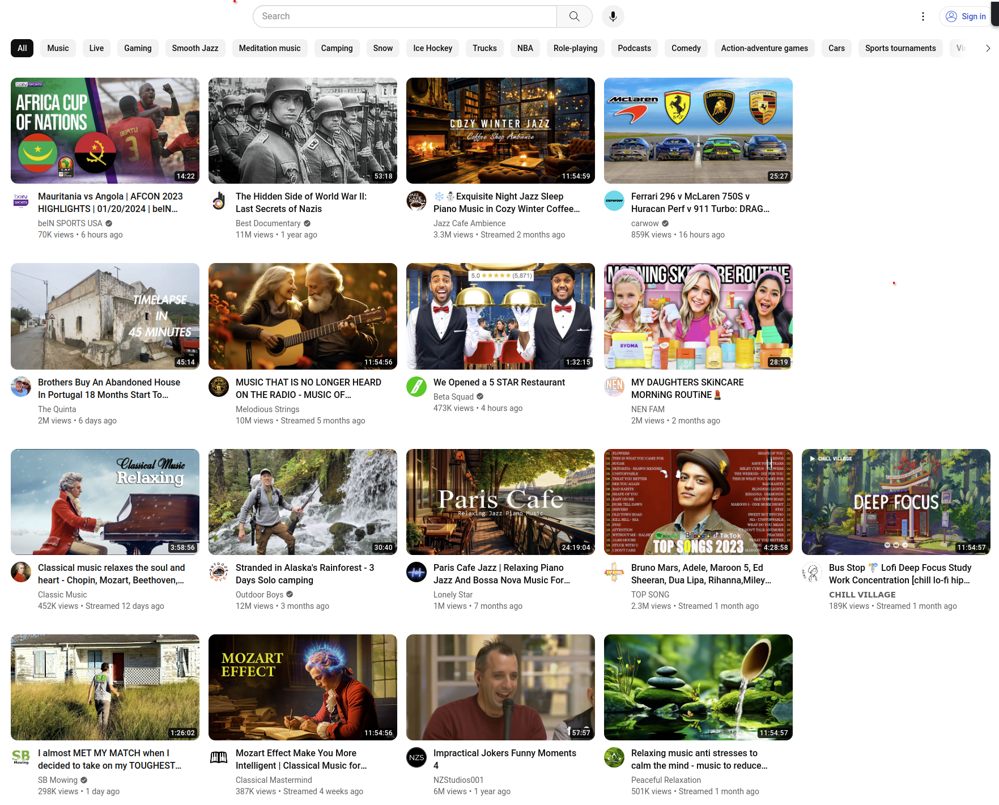
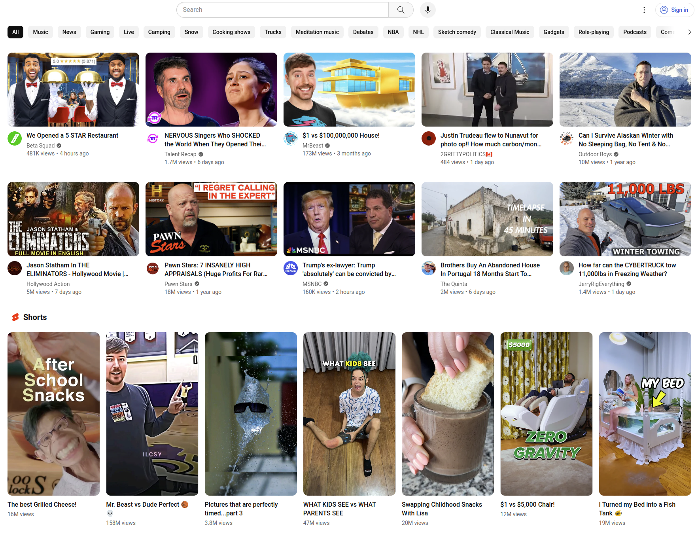

# PureYt
Chromium based YouTube extension that
- removes "Shorts" and "Trending" sections
- removes videos whose title contains banned regex expression in banned.json
- removes videos from channels in banned.json

## Usage
In browser, enable developer mode in Extension tab and load this directory.

Customize `banned.json` to filter video titles or channels. E.g.,
```yaml
{
    "banWords": [
        "!$",
        "^Meet",
        "^You won't",
        "^I ",
        "^Can I",
        "^Surpris",
        "^How",
        "^Why",
        "^Could",
        "^We "
    ],
    "banChannels": [
        "MrBeast",
        "Jordan Matter"
    ],
    "banIds": [
        "big-yoodle"  # top banner
    ],
    "banTags": [
        "ytd-reel-shelf-renderer",  # Shorts, Trending section
        "ytd-rich-section-renderer" # Shorts People also watched section
    ]
}
```

## After


## Before


